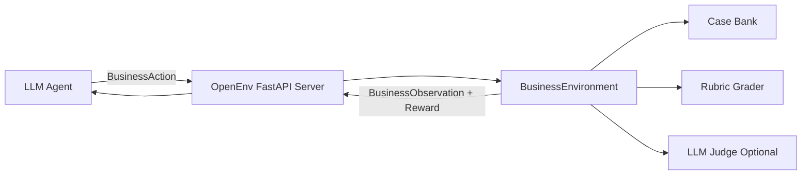
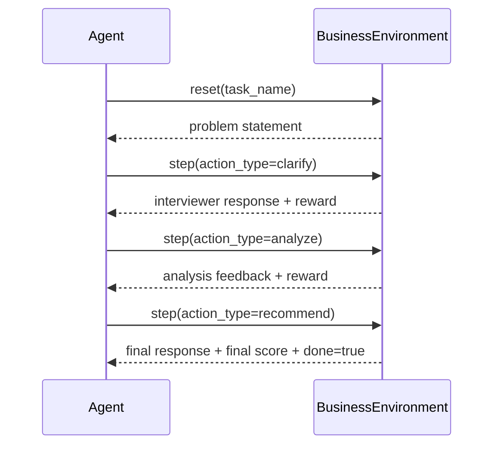

# BusinessEnv


<p align="center">
Business strategy meeting
  <!--  -->
</p>

> A multi-turn RL environment where an AI agent acts like a strategy consultant:
> ask better questions, reason with structure, and deliver actionable recommendations.

---

## Why This Project Exists

Most evaluation setups test one-shot answers. Real business reasoning is not one-shot.

`BusinessEnv` simulates a consulting-style case interview where the model must:

1. Ask clarifying questions
2. Build structured analysis
3. Deliver a final recommendation

The environment gives **dense rewards** (not just pass/fail), making it useful for RL training, benchmarking, and iterative agent improvement.

---

## Core Idea in One Diagram



---

## Episode Lifecycle



---

## Tasks

| Task | Difficulty | Typical Turns | What Agent Must Do |
|---|---:|---:|---|
| `profit_diagnosis` | Easy | 5-8 | Find why profits fell and propose fixes |
| `market_entry` | Medium | 8-12 | Evaluate if/how to enter a new market |
| `deal_advisor` | Hard | 12-16 | Analyze M&A fit, risk, valuation, integration |

---

## Action / Observation Contracts

### Action
- `message`: text generated by agent
- `action_type`: `clarify | analyze | recommend`
- `task_name`: `profit_diagnosis | market_entry | deal_advisor`

### Observation
- `interviewer_response`: simulator reply
- `reward`: reward for current step
- `done`: episode completion flag
- `turn_number`, `hints_triggered`, `cumulative_score`, `max_turns`

---

## Reward Philosophy

- Reward good diagnostic questions
- Reward structured analysis
- Reward grounded recommendations
- Penalize repetition and running out of turns
- Optional LLM-judge score on final recommendation

This design gives **learning signal at every turn**.

---

## Project Structure

```text
businessenv/
├── models.py
├── env.py
├── client.py
├── inference.py
├── openenv.yaml
├── Dockerfile
├── cases/
│   └── case_bank.py
├── graders/
│   ├── rubric_grader.py
│   └── llm_grader.py
└── server/
    ├── app.py
    ├── environment.py
    └── businessenv_environment.py
```

---

## Quick Start

### 1) Install dependencies

```bash
cd businessenv
uv sync
```

### 2) Validate environment

```bash
uv run python -m openenv.cli validate --verbose
```

### 3) Run server

```bash
uv run server
```

Open:
- `http://localhost:8000/health`
- `http://localhost:8000/docs`
- `http://localhost:8000/web`

---

## API Smoke Test (PowerShell)

```powershell
Invoke-RestMethod -Method Post -Uri "http://localhost:8000/reset" -ContentType "application/json" -Body '{"task_name":"profit_diagnosis"}'
Invoke-RestMethod -Method Post -Uri "http://localhost:8000/step" -ContentType "application/json" -Body '{"message":"What happened to revenue and costs?","action_type":"clarify","task_name":"profit_diagnosis"}'
Invoke-RestMethod -Method Post -Uri "http://localhost:8000/step" -ContentType "application/json" -Body '{"message":"RECOMMENDATION: prioritize pricing and cost actions.","action_type":"recommend","task_name":"profit_diagnosis"}'
```

---

## Inference Run

Set token first:

```powershell
$env:HF_TOKEN="hf_your_token_here"
uv run inference.py
```

You should see `[START]`, `[STEP]`, `[END]` logs for all tasks.

---

## Docker Run

```bash
docker build -t businessenv .
docker run -p 8000:8000 businessenv
```

---

## Submission Guide (Hackathon)

1. Validate
   - `uv run python -m openenv.cli validate --verbose`
2. Confirm local server endpoints
3. Run inference with `HF_TOKEN`
4. Push to HF Space:

```bash
huggingface-cli login
openenv push YOUR_USERNAME/businessenv
```

5. Final check on Space:
   - loads successfully
   - `/health` works
   - web UI opens
   - tagged per challenge rules

---

## Environment Variables

Use `.env.example`:

```env
HF_TOKEN=hf_your_token_here
API_BASE_URL=https://router.huggingface.co/v1
MODEL_NAME=Qwen/Qwen2.5-72B-Instruct
```

---

## License

BSD-style (same as project scaffold/license file).
