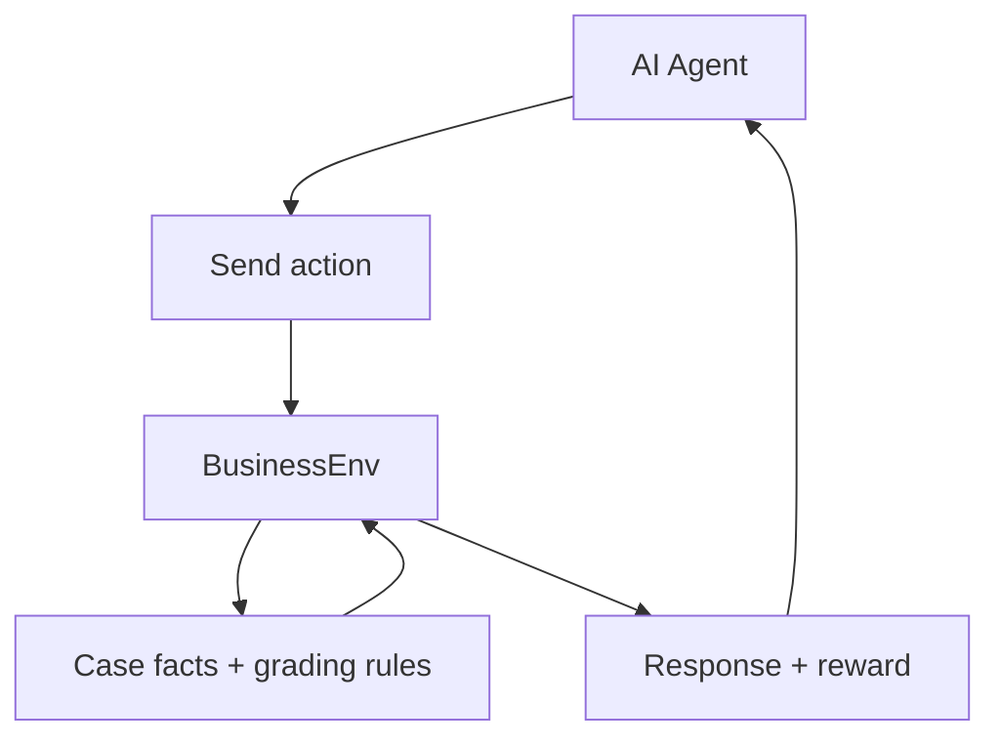

# BusinessEnv Explained Super Simply

<!-- <p align="center">
  
</p> -->

If this project feels confusing, this file explains it step by step in very simple words.

---

## 1) What is this project?

Imagine a game:

- The AI is a consultant.
- The environment is a fake client/interviewer.
- The AI must ask questions, think, and give advice.
- The environment gives points (reward) for good behavior.

That game is `BusinessEnv`.

---

## 2) Why do we need this?

Normal tests ask one question and get one answer.
Real thinking jobs are not like that.

In real consulting:
- You ask many questions
- You gather facts over time
- You make a final decision

This project trains/evaluates that multi-step behavior.

---

## 3) Big picture flow



---

## 4) What does the AI send?

The AI sends an **Action**:

- `message`: what it says
- `action_type`:
  - `clarify` (ask for info)
  - `analyze` (reason using framework)
  - `recommend` (final answer)
- `task_name`: which challenge it is solving

---

## 5) What does the environment send back?

It sends an **Observation**:

- interviewer reply
- reward for this step
- done or not done
- turn count
- hints on what rubric items were hit

---

## 6) What are the tasks?

There are 3 tasks:

1. `profit_diagnosis`
   - Find why profit dropped
2. `market_entry`
   - Decide whether and how to enter a market
3. `deal_advisor`
   - Evaluate an acquisition deal

Each has different difficulty and turn limits.

---

## 7) How rewards work (very important)

You get points for:
- good specific questions
- structured analysis
- useful recommendation

You lose points for:
- repeating same question
- wasting turns and not finishing

Final score can include:
- deterministic rubric score
- optional LLM-judge score

---

## 8) Folder map (what lives where)

```text
businessenv/
├── models.py                  # data shapes (Action/Observation/State)
├── env.py                     # main environment entrypoint
├── inference.py               # baseline runner
├── openenv.yaml               # OpenEnv manifest
├── cases/case_bank.py         # business scenarios
├── graders/rubric_grader.py   # deterministic scoring
├── graders/llm_grader.py      # optional LLM judge scoring
└── server/
   ├── app.py                  # API app
   ├── environment.py          # wrapper
   └── businessenv_environment.py  # core reset/step logic
```

---

## 9) How to run (Windows PowerShell)

```powershell
cd "path\to\businessenv"
uv sync
uv run python -m openenv.cli validate --verbose
uv run server
```

Open:
- `http://localhost:8000/health`
- `http://localhost:8000/docs`
- `http://localhost:8000/web`

---

## 10) Quick test calls

```powershell
Invoke-RestMethod -Method Post -Uri "http://localhost:8000/reset" -ContentType "application/json" -Body '{"task_name":"profit_diagnosis"}'
Invoke-RestMethod -Method Post -Uri "http://localhost:8000/step" -ContentType "application/json" -Body '{"message":"What happened to revenue and costs?","action_type":"clarify","task_name":"profit_diagnosis"}'
Invoke-RestMethod -Method Post -Uri "http://localhost:8000/step" -ContentType "application/json" -Body '{"message":"RECOMMENDATION: fix pricing and costs.","action_type":"recommend","task_name":"profit_diagnosis"}'
```

If these work, your core pipeline works.

---

## 11) Inference run

Set token:

```powershell
$env:HF_TOKEN="hf_your_token_here"
uv run inference.py
```

Without token, script exits (or LLM judge falls back depending path).

---

## 12) Docker run

```bash
docker build -t businessenv .
docker run -p 8000:8000 businessenv
```

If Docker fails, usually Docker Desktop is not running.

---

## 13) Submission checklist

- [ ] Validate passes
- [ ] Server runs
- [ ] Health/docs/web work
- [ ] All tasks run at least once
- [ ] Inference logs look correct
- [ ] Push to HF Space works

---

## 14) Beginner guide: submit to Hugging Face (step by step)

### A) Create account and install tools
1. Create a Hugging Face account at [https://huggingface.co](https://huggingface.co)
2. In terminal:

```bash
pip install -U huggingface_hub
```

### B) Login from terminal

```bash
huggingface-cli login
```

It will ask for your token:
- Go to Hugging Face settings -> Access Tokens
- Create token with write permissions
- Paste in terminal

### C) Validate your project before push

```bash
uv run python -m openenv.cli validate --verbose
```

### D) Push your environment

```bash
openenv push YOUR_USERNAME/businessenv
```

### E) Verify your Space
After push completes:
- Open your Space URL on Hugging Face
- Check app boots without crash
- Check `/health` works
- Open web UI and run one short episode

---

## 15) Beginner guide: submit code to GitHub (step by step)

### A) Create a new GitHub repo
1. Go to [https://github.com/new](https://github.com/new)
2. Name it (example: `businessenv`)
3. Keep it Public (if hackathon needs public) or Private
4. Click Create Repository

### B) Upload from local folder
From inside your project folder:

```bash
git init
git add .
git commit -m "Initial submission: businessenv project"
git branch -M main
git remote add origin https://github.com/YOUR_USERNAME/businessenv.git
git push -u origin main
```

### C) Double-check before sharing
- `.env` is NOT committed
- No API keys in code
- README is clear
- Repo opens and files are visible
- Add project tags/topics if needed

### D) Optional release
Create a GitHub release/tag when final:
- Go to Releases -> Draft new release
- Tag: `v0.1.0`
- Add short changelog

---

## 16) One-command recap for final submission

```bash
# 1) validate
uv run python -m openenv.cli validate --verbose

# 2) push code to github
git add .
git commit -m "Final hackathon submission"
git push

# 3) push environment to HF Space
huggingface-cli login
openenv push YOUR_USERNAME/businessenv
```

Push command (quick reference):

```bash
huggingface-cli login
openenv push YOUR_USERNAME/businessenv
```

---

## 17) In one line

`BusinessEnv` is a practice ground where an AI learns to think like a business consultant over multiple turns, with rewards that teach good reasoning habits.
